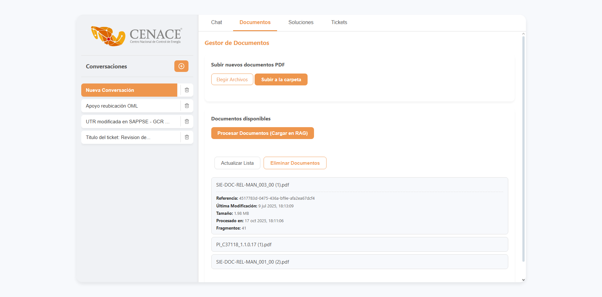
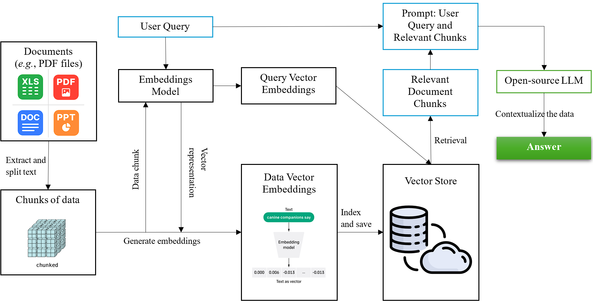

::: {style="text-align: justify"}
## 1. Manual de instalación y despliegue

### 1.1. Configuraciones importantes

* El proyecto está diseñado para ser desplegado en entornos **Linux** o **Windows** con Python `3.12.9`. Requiere acceso a **Ollama** (para la ejecución de modelos open-source), así como conectividad a una instancia de **MongoDB** para el registro del historial de conversaciones y tickets.
* La aplicación backend se expone a través de **FastAPI** en el puerto 8000. Es crucial asegurar que este puerto esté abierto y accesible en el entorno de despliegue.
* Todas las credenciales y configuraciones sensibles se gestionan mediante un archivo de variables de entorno (`.env`), garantizando la seguridad y facilidad de configuración.

### 1.2. Requisitos del sistema

* **CUDA**: Tarjeta de video y con drivers actualizados en el ambiente.
* **Python**: Versión 3.12.9.
* **Pip**: Última versión.
* **UV**: Última versión (gestor de paquetes y entornos).
* **Ollama**: Instalado y en ejecución en el servidor para el hosting de modelos open-source.
* **MongoDB**: Acceso remoto configurado para las colecciones de historial de conversaciones y tickets.
* **Podman**: Herramienta de virtualización y contenedores sin daemon; utilizado para correr MongoDB.

### 1.3. Dependencias principales del sistema

* **FastAPI** y **Uvicorn**: Utilizados para construir y servir la **API web** que expone los endpointsmdel *chatbot* y la gestión de documentos. Permiten crear una interfaz robusta y asíncrona.
* **Ollama (Python Client)**: Librería cliente para interactuar con el servicio **Ollama**, que hospeda y ejecuta los modelos de lenguaje *open-source* (`gemma:4b`) y de *embeddings* (`bge-m3:latest`) localmente.
* **Pymongo**: El controlador oficial de Python para **MongoDB**. Es esencial para interactuar con la base de datos donde se almacena el **historial de conversaciones**, la información de los **tickets** y el registro de **archivos procesados**.
* **FAISS (faiss-cpu)**: Biblioteca desarrollada por Meta AI para la **búsqueda eficiente de similitud** y agrupamiento de vectores densos. Es el núcleo de la **base de datos vectorial** del sistema.
* **UV**: Gestor de paquetes y entornos virtuales, asegura la reproducibilidad del entorno.
* **Otras dependencias**: Todas las demás librerías requeridas se detallan en el archivo `pyproject.toml`. La instalación de este archivo se detalla más adelante.

### 1.4. Instalación del sistema

1. Clonar el repositorio:
```bash
gh repo fork https://github.com/anmerino-pnd/proyectoCenace
cd cenacellm
```

2. Configurar el entorno:
```bash
pip install uv
uv venv
source .venv\Scripts\activate
# o `.venv\Scripts\activate` para Windows
uv pip install -e .
```

3. Configurar Ollama:

   Verifica que el servicio de Ollama esté instalado y activo, y que el modelo `gemma3:12b` y `bge-m3:latest` estén disponible.

```bash
curl -fsSL https://ollama.com/install.sh | sh # Para instalar Ollama
ollama serve
ollama list # Para verificar que el modelo gemma3:12b esté descargado y listo
ollama pull gemma3:12b # Correr esta línea en caso que el modelo no aparezca
ollama pull bge-m3:latest
```

4. Configurar variables de entorno:

   Antes de levantar el *backend*, asegurarse de que el archivo `.env` en la raíz del proyecto contenga las siguientes variables con sus valores correctos. 

```python
# Servidor donde está corriendo Ollama
OLLAMA_BASE_URL="http://localhost:11434"

# Conexión a MongoDB
MONGO_URI = "mongodb://localhost:27017" 
DB_NAME = "CENACE_LLM"
```

5. Preparar el backend:

  Con la ayuda de este comando arranca el contenedor de Mongo el cual es utilizado para guardar la información de las sesiones, conversaciones, documentos, etc.
```bash
podman run -d --name mongo \
  -p 27017:27017 \
  docker.io/library/mongo:7.0
```
  Este comando inicia la API, especificando el número del puerto
```bash
nohup uvicorn cenacellm.API.main:app --reload &
```
  El uso de `nogup` y `&` asegura que el proceso continúe ejecutándose en segundo plano incluso si la sesión SSH se cierra.

7. Verificar logs:

  Al correr la API con `nohup`, este genera un archivo `nohup.out`, con el cual podemos ver los logs del sistema, para eso solo hay que ubicarse en donde está dicho archivo y correr lo siguiente:

```bash
tail -f nohup.out
```
:::

::: {style="text-align: justify"}
## 2. Documentación técnica del código
La solución se basa en una arquitectura de **Recuperación Aumentada con Generación (RAG)**. La estructura modular del código, organizada en paquetes de Python, permite una clara separación de responsabilidades.

### 2.1. Estructura de carpetas y módulos
El proyecto sigue una estructura modular para facilitar la gestión y el mantenimiento. A continuación, se detalla el propósito de los módulos y clases principales, además de sus funciones clave.

#### 2.1.1. Documentos

##### **cenacellm/doccollection.py**

Este archivo es el encargado de procesar los archivos PDF, extraer su contenido y generar los chunks que serán utilizados para un posterior procesamiento.

* **Clases y funciones clave**

  * `class DisjointCollection(DocCollection)`:
    * `__init__`: 
      * **Propósito**: 
      * **Comportamiento**:
      
    * `get_chunks() -> list`:  
      * **Propósito**: 
      * **Parámetros**:
        * `texts (Union[Text, List[Text]])`: 
      * **Retorna**: 
      * **Comportamiento**: 

    * `load_pdf() -> List[Text]`:  
      * **Propósito**: 
      * **Parámetros**:
        * `pdf_path (str)`: 
        * `collection (str)`: 
      * **Retorna**: 
      * **Comportamiento**: 


#### 2.1.2. Embedder

##### **cenacellm/ollama/embedder.py**
Aquí se encuentra el modelo encargado de vectorizar los chunks...

* **Clases y funciones clave**

  * `class OllamaEmbedder(Embedder)`:
    * `__init__`: 
      * **Propósito**: 
      * **Comportamiento**:
      
    * `vectorize() -> NDarray`:  
      * **Propósito**: 
      * **Parámetros**:
        * `s (str)`: 
      * **Retorna**: 
      * **Comportamiento**: 

    * `vectorize_batch() -> list[np.ndarray]`:  
      * **Propósito**: 
      * **Parámetros**:
        * `texts (list[str])`: 
      * **Retorna**: 
      * **Comportamiento**: 

    * `dim() -> int`:  
      * **Propósito**: 
      * **Retorna**: 
      * **Comportamiento**: 

#### 2.1.3. Vector Store

##### **cenacellm/vectorstore.py**
Aquí se encuentra el modelo encargado de guardar los vectores...

* **Clases y funciones clave**

  * `class FAISSVectorStore(VectorStore)`:
    * `__init__`: 
      * **Propósito**: 
      * **Comportamiento**:
      
    * `get_similar() -> list`:  
      * **Propósito**: 
      * **Parámetros**:
        * `v (np.ndarray)`: 
        * `k (int)`:
        * `filter_metadata (Dict[str, str])`:
      * **Retorna**: 
      * **Comportamiento**: 

    * `add_text() -> None`:  
      * **Propósito**: 
      * **Parámetros**:
        * `v (np.ndarray)`: 
        * `t (Text)`: 
      * **Retorna**: 
      * **Comportamiento**: 

    * `add_texts() -> None`:  
      * **Propósito**: 
      * **Parámetros**:
        * `vectors (list[np.ndarrar])`:
        * `chunks (list[Text])`:
      * **Retorna**: 
      * **Comportamiento**: 

    * `save_index() -> None`:  
      * **Propósito**: 
      * **Retorna**: 
      * **Comportamiento**: 

    * `distance() -> None`:  
      * **Propósito**: 
      * **Parámetros**:
        * `v1 (np.ndarrar)`:
        * `v2 (np.ndarrar)`:
      * **Retorna**: 
      * **Comportamiento**: 

    * `delete() -> None`:  
      * **Propósito**: 
      * **Parámetros**:
        * `idx (int)`:
      * **Retorna**: 
      * **Comportamiento**: 

    * `update_metadata() -> None`:  
      * **Propósito**:  
      * **Parámetros**:
        * `idx (int)`:
        * `new_metadata (Dict[str, str])`:
      * **Retorna**: 
      * **Comportamiento**: 

    * `delete_by_reference() -> None`:  
      * **Propósito**:  
      * **Parámetros**:
        * `reference_id (str)`:
      * **Comportamiento**: 

#### 2.1.4. Agente

##### **cenacellm/ollama/assistant.py**
Aquí se encuentra el modelo de lenguaje encargado de responder...

* **Clases y funciones clave**

  * `class OllamaAssistant(Assistant)`:
    * `__init__`: 
      * **Propósito**: 
      * **Comportamiento**:
      
    * `load_history() -> list`:  
      * **Propósito**: 
      * **Parámetros**:
        * `user_id (str)`: 
        * `conversation_id (str)`:
      * **Retorna**: 
      * **Comportamiento**: 

    * `save_history() -> None`:  
      * **Propósito**: 
      * **Parámetros**:
        * `user_id (str)`: 
        * `conversation_id (str)`:
        * `history (list)`: 
        * `conversation_title (Optional[str])`: 
      * **Comportamiento**: 

    * `save_backup() -> None`:  
      * **Propósito**: 
      * **Parámetros**:
        * `user_id (str)`:
        * `history_chunk (list)`:
      * **Comportamiento**: 

    * `clear_conversation_history() -> None`:  
      * **Propósito**: 
      * **Parámetros**:
        * `user_id (str)`:
        * `conversation_id (str)`:
      * **Comportamiento**: 

    * `delete_conversation() -> None`:  
      * **Propósito**: 
      * **Parámetros**:
        * `user_id (str)`:
        * `conversation_id (str)`:
      * **Retorna**: 
      * **Comportamiento**: 

    * `make_metadata() -> CallMetadata`:  
      * **Propósito**: 
      * **Parámetros**:
        * `response (GenerateResponse)`:
        * `duration (float)`:
        * `references`:
      * **Retorna**: 
      * **Comportamiento**: 

    * `answer() -> Tuple[Generator[str, None, None], str, Dict[str, Any]]`:  
      * **Propósito**:  
      * **Parámetros**:
        * `question (Question)`:
        * `chunks (Chunks)`:
        * `user_id (str)`:
        * `conversation_id (str)`:
      * **Retorna**: 
      * **Comportamiento**: 

    * `update_message_metadata() -> bool`:  
      * **Propósito**:  
      * **Parámetros**:
        * `user_id (str)`:
        * `message_id (str)`:
        * `new_metadata (Dict[str, Any])`:
      * **Comportamiento**: 


    * `get_liked_solutions() -> List[Dict[str, Any]]`:  
      * **Propósito**:  
      * **Parámetros**:
        * `user_id (str)`:
      * **Retorna**:
      * **Comportamiento**: 


    * `get_user_conversations() -> List[Dict[str, Any]]`:  
      * **Propósito**:  
      * **Parámetros**:
        * `user_id (str)`:
      * **Retorna**:
      * **Comportamiento**: 


    * `has_liked_solution_in_conversation() -> bool`:  
      * **Propósito**:  
      * **Parámetros**:
        * `conversation_id (str)`:
      * **Retorna**:
      * **Comportamiento**: 


#### 2.1.5. RAG

##### **cenacellm/rag.py**
Aquí se encuentra el sistema RAG...

* **Clases y funciones clave**

  * `class RAG`:
    * `__init__`: 
      * **Propósito**: 
      * **Comportamiento**:
      
    * `_load_processed_files() -> Dict[str, Any]`:  
      * **Propósito**: 
      * **Retorna**: 
      * **Comportamiento**: 

    * `_save_processed_files() -> None`:  
      * **Propósito**: 
      * **Comportamiento**: 

    * `_delete_processed_file() -> None`:  
      * **Propósito**: 
      * **Parámetros**:
        * `file_key (List[str])`:
      * **Comportamiento**: 

    * `_load_processed_solutions_ids() -> set`:  
      * **Propósito**: 
      * **Comportamiento**: 

    * `_add_processed_solution_id() -> None`:  
      * **Propósito**: 
      * **Parámetros**:
        * `user_id (str)`:
        * `message_id (str)`:
      * **Retorna**: 
      * **Comportamiento**: 

    * `load_documents() -> list`:  
      * **Propósito**: 
      * **Parámetros**:
        * `folder_path (str)`:
        * `collection_name (str)`:
        * `force_reload (bool)`:
      * **Retorna**: 
      * **Comportamiento**: 

    * `query() -> Tuple[Generator[str, None, None], List, str, Dict[str, Any]]`:  
      * **Propósito**: 
      * **Parámetros**:
        * `user_id (str)`:
        * `conversation_id (str)`:
        * `question (str)`:
        * `k (int)`:
        * `filter_metadata (Optional[Dict[str, Any]])`:
      * **Retorna**: 
      * **Comportamiento**: 


    * `answer() -> Generator[Union[str, Dict[str, Any]], None, None]`:  
      * **Propósito**: 
      * **Parámetros**:
        * `user_id (str)`:
        * `conversation_id (str)`:
        * `question (str)`:
        * `k (int)`:
        * `filter_metadata (Optional[Dict[str, Any]])`:
      * **Retorna**: 
      * **Comportamiento**: 

... más funciones


#### 2.1.6. API

##### **cenacellm/API/chat.py**
Aquí se encuentra la ejecución del sistema rag...

* **Clases y funciones clave**

  * `class QueryRequest`:
    * `__init__`: 
      * **Propósito**: 
      * **Comportamiento**:

... más funciones

##### **cenacellm/API/main.py**
Aquí se encuentra el main de todo el sistema y las llamadas FastAPI...

* **Clases y funciones clave**

  * `/chat`:
    * **Propósito**: 
    * **Comportamiento**:

  * `/metadata`:
    * **Propósito**: 
    * **Comportamiento**:

  * `/history/user_id/conversation_id`:
    * **Propósito**: 
    * **Comportamiento**:

... más llamadas


### 2.2. Modelos LLM utilizados
El flujo de información en el sistema RAG sigue dos rutas principales:

1.  Indexación de documentos:
  * Los archivos PDF son cargados y procesados por el módulo `doccollection.py`.
  * `doccollection` divide cada documento en fragmentos.
  * Cada fragmento es enviado al que se encuentra en `embedder.py` y el modelo `bge-m3` genera su representación vectorial.
  * Los vectores resultantes se almacenan en la base de datos vectorial de FAISS, implementada en `vectorstore.py`, junto con sus metadatos.

2. Proceso de consulta (QA):
  * Una consulta de usuario llega el *endpoint* de `chat.py`.
  * La consulta es vectorizada por el `embedder`.
  * El `vectorstore` realiza una búsqueda de similitud semántica para recuperar los fragmentos de documento más relevantes.
  * Estos fragmentos se envían al `assistant.py`, que los utiliza como contexto.
  * El `assistant` utiliza el LLM (`gemma3:4b`) para generar una respuesta coherente y contextualizada.
  * La respuesta es devuelta al usuario a través del `chat.py` y el `main.py`.

### 2.3. Puntos de entrada y funciones clave

* **Gestión de conversaciones:** El módulo `assistant.py` gestiona el historial de conversación en MongoDB, permitiendo que el chatbot mantenga un contexto limitado con el usuario.
* **Gestión de tickets:** Las funciones `add_ticket` y `update_ticket_metadata` en `rag.py` y sus respectivos *endpoints* en `chat.py` demuestran la capacidad del sistema para interactuar y actualizar una base de datos de tickets.
* **Bucle de retroalimentación:** La funcionalidad `has_liked_solution_in_conversation` permite identificar y potencialmente re-indexar soluciones validadas por los usuarios, mejorando continuamente la base de conocimientos.

:::

::: {style="text-align: justify"}
## 3. Guía de entrenamiento y mejora


### 3.1. Generación de la base de datos vectorial

La base de conocimientos del chatbot se construye a partir de un proceso que comprende la extracción, segmentación y vectorización del contenido textual proveniente de documentos en formato PDF.

Los vectores resultantes son posteriormente indexados y almacenados en una base de datos vectorial, la cual constituye el núcleo de la recuperación de información relevante durante las interacciones con el chatbot.

### 3.2. Flujo de la interacción

El usuario debe acceder a la pestaña **Documentos**, donde podrá seleccionar los archivos que desea incorporar a la base de conocimientos del sistema.
Una vez elegidos, los documentos **se suben a la carpeta** correspondiente dentro del entorno donde se encuentra desplegado el sistema (backend).
Posteriormente, estos archivos son procesados siguiendo el flujo descrito en el apartado anterior, dando como resultado la creación de la base vectorial o base de conocimientos del sistema.

{width=100%}

### 3.3. Recomendaciones para futura mejora

1. **Lectura de documentos escaneados**

  Actualmente, el sistema **no puede extraer información de documentos escaneados**. Sería recomendable integrar un módulo de **Reconocimiento Óptico de Caracteres (OCR)** para ampliar la capacidad de análisis, o de igual manera, **Modelo Multimodales** que pudieran extraer la información y almacenarla en documentos PDF que sean posteriormente vectorizados.

2. **Sistema de seguridad para el inicio de sesión**

  El mecanismo de inicio de sesión actual es básico, pues solo requiere ingresar el nombre del usuario.

  Aunque esta simplicidad se ajusta al alcance inicial del proyecto, se sugiere incorporar un sistema de autenticación más robusto, que garantice la seguridad de acceso y manejo de información.

3. **Sistema de corrección de ortografía**

  Durante el desarrollo de los modelos de clasificación, se identificó que la falta de ortografía en los tickets afectaba la calidad del análisis.

  Se propuso el desarrollo de un sistema tipo journalist capaz de identificar [las 5 W's](https://en.wikipedia.org/wiki/Five_Ws) y reconstruir el contexto completo del texto, corrigiendo iterativamente los errores ortográficos al momento de cargar los datos.
:::


::: {style="text-align: justify"}
## 4. Arquitectura del sistema
El siguiente diagrama ilustra la arquitectura general del ssitema del chatbot, mostrando los componentes principales y el flujo de datos desde la interacción del usuario hasta la generación de respuestas y el almacenamiento del historial.

{width=100%}

### 4.1. Componentes clave de conversación y chat

* `POST /chat/stream`: Endpoint principal para la interacción conversacional. Recibe una consulta y un `conversation_id`, y devuelve una respuesta generada por el LLM en tiempo real a través de un stream.

* `GET /chat/history/{user_id}/{conversation_id}`: Recupera el historial de mensajes de una conversación específica.

* `POST /conversations`: Crea una nueva conversación, generando un `conversation_id` único.

* `GET /conversations/{user_id}`: Lista todas las conversaciones de un usuario, incluyendo sus títulos y la fecha de la última actualización.

* `DELETE /conversations`: Elimina una conversación específica y su historial de la base de datos.

* `PATCH /message-metadata`: Permite actualizar los metadatos de un mensaje, utilizado para la funcionalidad de "gustar" una solución.

### 4.2. Componentes clave de documentos y soluciones

* `POST /documents`: Permite cargar nuevos archivos (en formato PDF) a la base de datos vectorial para expandir la base de conocimientos.

* `GET /documents`: Lista todos los documentos que han sido procesados y están disponibles para la consulta.

* `DELETE /documents`: Elimina un documento específico de la base de datos vectorial, eliminando también su referencia y los fragmentos asociados.

* `POST /solutions`: Procesa y re-indexa soluciones "gustadas" por los usuarios, agregándolas como nuevos documentos a la base de datos vectorial para mejorar la precisión del sistema.

* `DELETE /solutions`: Elimina una solución específica de la base de datos vectorial.

### 4.3. Componentes clave de tickets

* `GET /tickets`: Recupera una lista de todos los tickets almacenados en la base de datos de MongoDB.

* `POST /tickets`: Permite añadir un nuevo ticket a la base de datos, con campos como título, descripción y categoría.

* `PATCH /tickets/{ticket_reference}`: Actualiza los metadatos de un ticket existente, como su estado de solución (`is_solved`).

:::